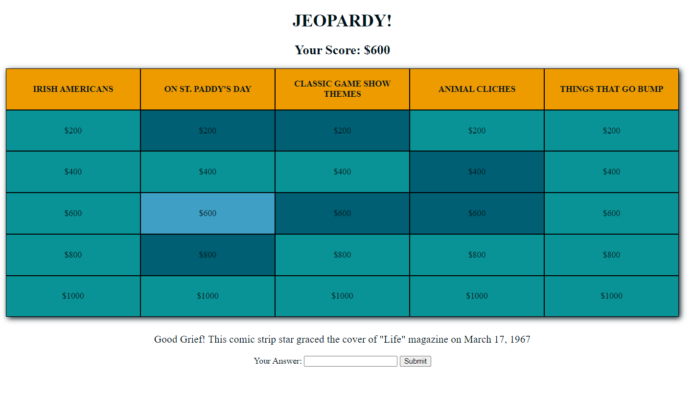

# Jeopardy

This web application is an interactive Jeopardy board! Players are asked a question after selecting a card, after which they can attempt to submit the right answer for a reward. Answers are displayed in console for testing.

The board is styled with CSS grid and uses jQuery to dynamically populate random data from a json file. A new game is loaded every time the page is refreshed, but player score is accumulative and stored in local storage. 

## Images

